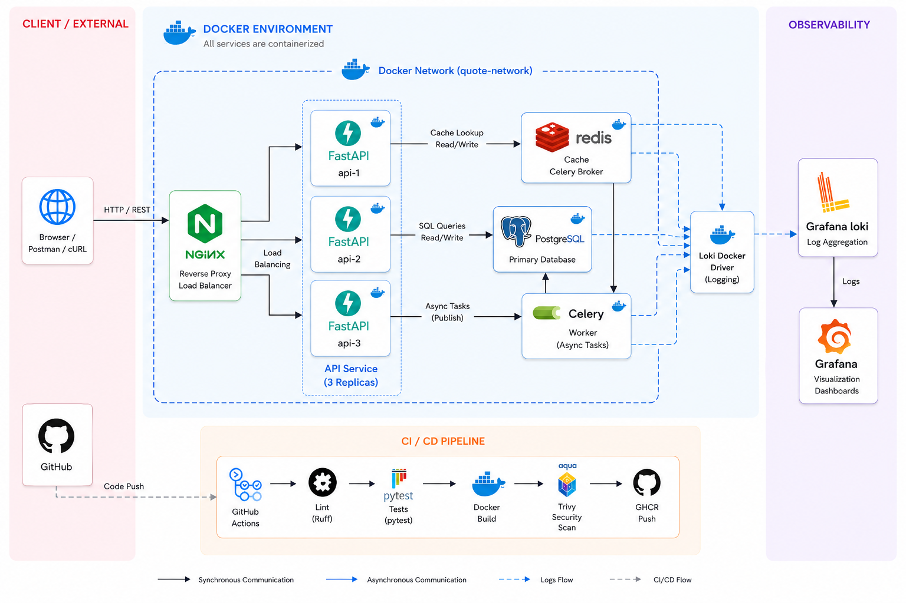
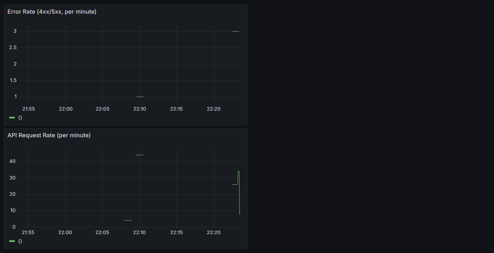

# Quote API — A Distributed System Case Study

A REST API for storing and retrieving quotes, built as a deliberate
exercise in production infrastructure patterns: containerization,
horizontal scaling, caching, async processing, CI/CD with security
gating, and observability. The application logic is intentionally
simple — the infrastructure around it is the actual subject of this
project.

## Architecture



## Incidents found and fixed during development

This project was built by deliberately implementing the naive version
of each piece first, observing the real problem it causes, then fixing
it — rather than starting from a "correct" version with no visible
reasoning behind it. The four most concrete examples:

### 1. Container ignored `docker stop` for the full 10-second grace period

**Symptom:** `docker stop` consistently took ~10 seconds before forcefully
killing the container.

**Root cause:** The Dockerfile used shell-form `CMD uvicorn ...`, which
runs the command via `/bin/sh -c`, making the shell — not uvicorn — PID 1.
SIGTERM was delivered to the shell, which didn't forward it, so Docker
exhausted its grace period and fell back to SIGKILL.

**Fix:** Switched to exec-form `CMD ["uvicorn", ...]`, making uvicorn
PID 1 directly. Confirmed via `docker exec ... ps aux` that PID 1 changed
from `/bin/sh` to `uvicorn`, and `docker stop` time dropped to under 1 second.

### 2. Docker image was over 1GB

**Symptom:** Single-stage build using `python:3.11` resulted in a [your
actual number]MB image.

**Root cause:** The full `python:3.11` base image includes a complete
build toolchain (compilers, build-essential) that the application never
needs at runtime — only during dependency installation.

**Fix:** Multi-stage build — a `builder` stage with full build tools
installs dependencies into an isolated directory; a `production` stage,
based on `python:3.11-slim`, copies in only the installed packages.
Result: [your actual number]MB, a [calculate %] reduction.

### 3. Stale cache data served indefinitely after a direct database update

**Symptom:** Updating a quote's text directly in Postgres (bypassing the
API) resulted in the API continuing to serve the old, cached value with
no expiry.

**Root cause:** Initial caching implementation stored values in Redis
with no TTL — once cached, nothing ever invalidated automatically.

**Fix:** Added a TTL (5 min, ±30s jitter to avoid synchronized mass
expiry) as a baseline safety net for ANY staleness source, plus explicit
cache invalidation on the API's own write paths (PUT/DELETE) for
near-immediate correction when the write goes through the API itself.
Verified both mechanisms independently — TTL expiry tested with a
shortened window, explicit invalidation tested via the API's update
endpoint.

### 4. Real, undisclosed-to-me-until-scanned CVEs in transitive dependencies

**Symptom:** Adding a Trivy vulnerability scan to CI immediately failed
the build on two HIGH-severity CVEs.

**Root cause:** `jaraco.context` and `wheel`, both vendored internally
by `setuptools`, were outdated versions pulled in transitively via an
old `pip`/`setuptools` bundled in the base Python image — not anything
listed directly in `requirements.txt`.

**Fix:** Added an explicit `pip install --upgrade pip` at the start of
the builder stage, pulling in a current `setuptools` with patched
vendored dependencies. Re-scanned and confirmed clean.

**Why this one matters:** this wasn't a staged example — it's a real
scan catching a real, previously-invisible vulnerability in dependencies
several layers removed from anything explicitly chosen, which is
precisely the scenario vulnerability scanning exists to catch.


## What's verified, not just configured

- **Load balancing**: confirmed via repeated requests showing different
  container hostnames answering identical requests through Nginx.
- **Cache consistency across replicas**: confirmed a value cached by
  one replica's request was immediately visible to requests served by
  different replicas (proves the shared-Redis design, vs. an in-process
  cache, was the right call).
- **Async task isolation**: confirmed the API remained fully responsive
  to unrelated requests while a deliberately-slowed (15s) background
  task ran concurrently in a separate worker container.
- **Startup ordering**: confirmed, via `docker compose ps`, that the API
  does not start until Postgres and Redis report `healthy`, not just
  "running" — closing a real, reproduced cold-start race condition.
- **Log persistence**: confirmed log history survives a container
  restart, proving logs live in a centralized store (Loki), not in any
  individual container's filesystem.
- **CI security gate**: confirmed by a real Trivy-caught CVE that
  failed the pipeline and blocked a push to the registry, then cleared
  after the fix — not just a passing pipeline with no failure ever
  observed.


  ## Running it locally

```bash
git clone <your-repo-url>
cd quote-api
docker compose up -d --scale api=3
docker compose exec api python -m app.seed_quotes
```

API: http://localhost/quote/random
Grafana: http://localhost:3000 (admin/admin)

## Tests

```bash
pytest tests/test_quotes.py tests/test_worker.py -v
```


## CI/CD pipeline

- **lint**: ruff + Compose/Nginx config validation — fails fast, before
  any slower step runs.
- **test**: pytest against both SQLite (fast, local-dev parity) and a
  real ephemeral Postgres service container (catches dialect-specific
  issues SQLite would hide).
- **build**: multi-stage Docker build, scanned with Trivy
  (CRITICAL/HIGH, fixable-only) — a failing scan blocks the pipeline
  entirely; verified with a real caught CVE, not just configured.
- **push**: only runs on a direct push to `main` (never on pull
  requests), publishing to GHCR with both a commit-SHA tag and `latest`.